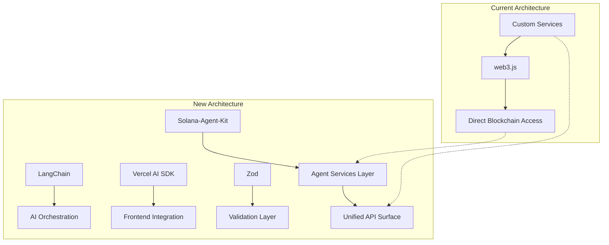

# Solana-Agent-Kit Migration Plan

## Overview
Comprehensive strategy for migrating from Solana/web3.js to Solana-Agent-Kit while integrating:
- LangChain for AI capabilities
- Vercel AI SDK for frontend integration
- ElizaOS for conversational interfaces
- Zod for schema validation

## Architecture Diagram


## Phase 1: Core Migration
### 1. Solana-Agent-Kit Setup
- Replace all web3.js imports (56 files identified)
- Implement agent services for:
  - Wallet management
  - Transaction orchestration
  - Blockchain state monitoring

### 2. LangChain Integration
- AI-powered trading strategies
- Natural language processing for:
  - Trade analysis
  - Risk assessment
  - Pattern recognition

## Phase 2: Frontend Modernization
### 1. Vercel AI SDK
- Real-time data streaming
- AI-enhanced UI components
- Conversational interfaces via ElizaOS

### 2. Zod Validation
- Schema definitions for:
  - Transaction payloads
  - API responses
  - Configuration objects
- Runtime validation layer

## Documentation Requirements
1. **API Reference Migration Guide**
   - Web3.js to Agent-Kit mapping table
   - Method compatibility matrix
   - Error handling changes

2. **Architecture Documentation**
   - System context diagrams
   - Sequence diagrams for key flows
   - Deployment topology

3. **Testing Strategy**
   - Migration test cases
   - Performance benchmarks
   - Security validation

## Delivery Method
- Modular documentation in `/docs` directory:
  ```
  /docs
  ├── api
  ├── architecture
  ├── migration
  └── examples
  ```
- Versioned releases with changelog
- Interactive code samples

## MCP-Gemini Integration
1. **Prerequisites**
   - MCP server configuration
   - Gemini API access
   - Authentication setup

2. **Configuration Steps**
   ```typescript
   // Example configuration
   const mcpConfig = {
     server: 'gemini-mcp',
     tools: ['ai_orchestration', 'data_validation'],
     auth: process.env.MCP_KEY
   };
   ```

3. **Use Case Optimization**
   - Real-time market analysis
   - Predictive modeling
   - Anomaly detection